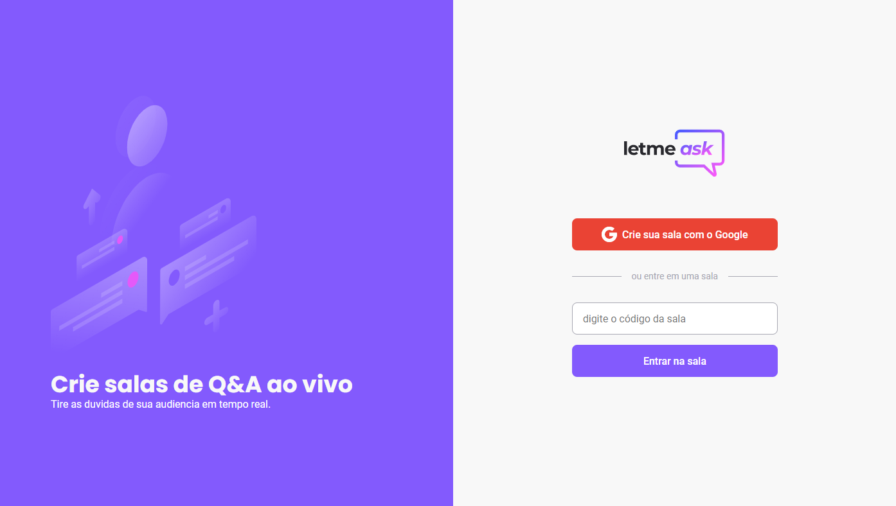

# LetMeAsk

<p align="center">	
   
</p>
<p align="center">	
  Projeto desenvolvido durante a **[Next Level Week #06](https://nextlevelweek.com/)**
  </p>
 
  
## :computer: Tecnologias
Esse projeto foi desenvolvido utilizando as seguintes tecnologias:

- [Typescript][typescript-url]
- [React][react-url]
- [Firebase][firebase-url]

## :pencil: Funcionalidades

- Letmeask um sistema de criação de salas de perguntas e respostas (Q&A) para criadores de conteúdo, de maneira organizada e democrática.

## 🛠 Requerimentos

- [Node.js][node-url]
- [Yarn][yarn-url] or [npm][npm-url]
- Uma conta no [Firebase](https://firebase.google.com/) e um projeto para utilizarmos o Realtime Database e Authentication como serviço.

## 💻 Como executar o projeto

```bash
# Clone o Repositório
$ git clone https://github.com/NicolasElena/nlwreact-letmeask.git

# Acesse a pasta web
$ cd nlwreact-letmeask

# Instale as dependências do projeto
$ yarn install
# ou
$ npm i

# Execute a aplicação web
$ yarn start
# ou
$ npm run start
```

Endereço da aplicação web: http://localhost:3000/

## 📓 Licença

Esse projeto esta sobre [MIT license](./LICENSE).

⭐️Feito com carinho por [Nicolas Elena][nick-profile-url]⭐️

<!-- VARS -->

[react-url]: https://reactjs.org/
[firebase-url]: https://firebase.google.com/
[typescript-url]: https://www.typescriptlang.org/
[nick-profile-url]: https://github.com/NicolasElena
[node-url]: https://nodejs.org/en
[yarn-url]: https://classic.yarnpkg.com/
[npm-url]: https://www.npmjs.com/

<!-- VARS -->
